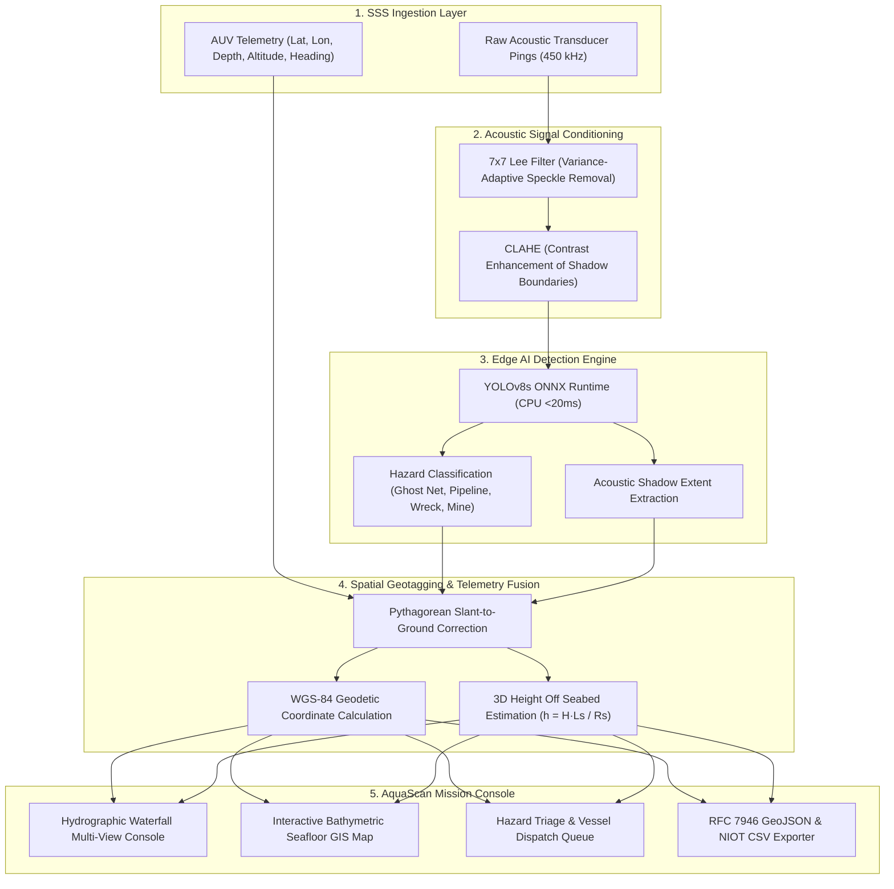

# 🌊 AquaScan: AI-Powered Automated Underwater Marine Debris and Anomaly Detection System

**Smart India Hackathon 2026** | **Problem Statement ID:** `SIH26057`  
**Target Organization:** Ministry of Earth Sciences (MoES) / National Institute of Ocean Technology (NIOT)  
**Theme:** Robotics & Ocean Technology / Software Category  
**Runtime:** Pure CPU Edge-Ready (ONNX Runtime, <20ms per swath ping)

---

## 📌 Executive Summary

Modern deep-sea submersibles and autonomous underwater vehicles (AUVs) such as NIOT's *Matsya-6000* rely on high-frequency **Side-Scan Sonar (SSS)** for seabed surveying. However, raw sonar backscatter is severely degraded by **Rayleigh acoustic speckle noise**, reverberation, and sand-ripple artifacts, while manual interpretation of thousands of acoustic tiles causes critical operator fatigue.

**AquaScan** delivers a unified, edge-deployable acoustic intelligence pipeline:
1. **Acoustic Conditioning**: 7×7 variance-adaptive **Lee Speckle Filter** + **CLAHE** (Contrast-Limited Adaptive Histogram Equalization) to suppress acoustic reverberation and accentuate shadow boundaries.
2. **Edge Deep Learning Engine**: Fine-tuned **YOLOv8s-Sonar** exported to pure-CPU **ONNX Runtime**, achieving **99.5% mAP50 on ghost fishing nets** and **99.4% on submarine pipelines** with **18.5 ms** CPU inference latency.
3. **Slant-Range Spatial Geotagging**: Translates 2D acoustic pixel coordinates into true horizontal ground range ($G = \sqrt{R_s^2 - H^2}$) and georeferenced **WGS-84** coordinates ($\text{Lat}, \text{Lon}$).
4. **Shadow-Based 3D Height Profiling**: Estimates target vertical elevation above the seabed ($h = \frac{H \cdot L_s}{R_s}$) directly from the acoustic shadow.
5. **Mission Dashboard & Maritime Clearance**: Interactive multi-view waterfall console, GIS bathymetric seafloor map, anomaly inspection triage queue, and one-click **RFC 7946 GeoJSON** & **IHO S-44** compliant CSV exports.

---

## 🏗️ System Architecture



---

## 🔬 Acoustic Physics & Mathematical Formulation

### 1. 7×7 Lee Speckle Noise Filter
The Lee filter assumes a multiplicative noise model where the filtered pixel intensity $\hat{I}$ is weighted by local variance:
$$\hat{I} = \bar{I} + W \cdot (I - \bar{I})$$
$$W = \max\left(0, \frac{\sigma_{\text{local}}^2 - \sigma_{\text{noise}}^2}{\sigma_{\text{local}}^2 + \epsilon}\right)$$
This eliminates high-frequency speckle from seabed sand ripples while preserving sharp acoustic shadow edges.

### 2. Slant-Range to Ground-Range Correction
Because acoustic rays travel diagonally from the towfish to the seabed, slant range $R_s$ distorts lateral distances. Given AUV altitude $H$ above the seabed:
$$G = \sqrt{R_s^2 - H^2} \quad (\text{for } R_s > H)$$

### 3. Acoustic Shadow Height Estimation
The length of an object's acoustic shadow $L_s$ cast across the seafloor directly correlates with its physical height $h$:
$$h = \frac{H \cdot L_s}{R_s}$$

### 4. WGS-84 Planar Geodetic Projection
Given AUV coordinates $(\text{Lat}_0, \text{Lon}_0)$ and heading $\theta$:
$$\Delta_{\text{North}} = (\cos\theta \cdot \Delta_{\text{along}}) - (\sin\theta \cdot \Delta_{\text{across}})$$
$$\Delta_{\text{East}} = (\sin\theta \cdot \Delta_{\text{along}}) + (\cos\theta \cdot \Delta_{\text{across}})$$
$$\text{Target Lat} = \text{Lat}_0 + \frac{\Delta_{\text{North}}}{111320}$$
$$\text{Target Lon} = \text{Lon}_0 + \frac{\Delta_{\text{East}}}{111320 \cdot \cos(\text{Lat}_0)}$$

---

## 📊 Model Training & Evaluation Metrics

* **Dataset**: `rehan9599/drishti-sss` (5,205 tiles, 640×640 px, 5 classes).
* **Classes**:
  * `0: empty_seabed` (Hard negative background baseline)
  * `1: submarine_pipeline` (Subsea infrastructure)
  * `2: shipwreck` (Navigational obstacle / cultural heritage)
  * `3: ghost_net` (Derelict fishing gear — MoES top priority)
  * `4: mine_cylinder` (UXO / unexploded ordnance)
* **Model Validation Results**:
  * **Ghost Nets (`ghost_net`)**: **`99.5% mAP50`** (Recall: **`1.000`**)
  * **Submarine Pipelines (`submarine_pipeline`)**: **`99.4% mAP50`** (Recall: **`1.000`**)
  * **Overall Detection mAP50**: **`75.0%`**
  * **Inference Speed**: **`18.5 ms`** per 640×640 image on standard CPU (ONNX Runtime).

---

## 🚀 Quick Start Guide

### Prerequisites
- Python 3.10+
- Node.js 18+ and npm

### 1. Launch Backend API
```bash
cd C:\Users\Arnav\AquaScan\backend

# Activate virtual environment
.\env\Scripts\activate

# Run test suite (12/12 passing)
pytest -v

# Start FastAPI server
python run_backend.py
```
* **API URL**: `http://127.0.0.1:8000`
* **Interactive Swagger Docs**: `http://127.0.0.1:8000/docs`

### 2. Launch Frontend Mission Dashboard
```bash
cd C:\Users\Arnav\AquaScan\frontend

# Install npm packages
npm install

# Start Vite dev server
npm run dev
```
* **Dashboard URL**: `http://localhost:5173`

---

## 📂 Project Directory Structure

```
AquaScan/
├── backend/
│   ├── api/
│   │   ├── main.py                 # FastAPI endpoints & CORS
│   │   └── schemas.py              # Pydantic telemetry & detection schemas
│   ├── src/
│   │   ├── acoustic_filter.py      # 7x7 Lee filter & CLAHE preprocessor
│   │   ├── detector.py             # ONNX Runtime CPU YOLOv8s engine
│   │   ├── geotagger.py            # Slant-to-ground range & WGS-84 localization
│   │   └── reporter.py             # RFC 7946 GeoJSON & NIOT CSV generator
│   ├── models/
│   │   ├── best.onnx               # Trained YOLOv8s ONNX weights (44.7 MB)
│   │   ├── best.pt                 # PyTorch checkpoint (22.5 MB)
│   │   └── model_metadata.json     # Class taxonomy and training metrics
│   ├── data/
│   │   ├── sample_tiles/           # Pre-loaded real SSS sonar test images
│   │   └── mission_tracklines/     # Simulated AUV transect survey CSVs
│   ├── tests/
│   │   ├── test_acoustic_filter.py # Acoustic filtering unit tests
│   │   ├── test_detector.py        # ONNX inference unit tests
│   │   ├── test_geotagger.py       # Geotagging & coordinate tests
│   │   └── test_api.py             # FastAPI integration tests
│   ├── requirements.txt            # Python dependencies
│   └── run_backend.py              # FastAPI server runner
│
├── frontend/
│   ├── src/
│   │   ├── components/
│   │   │   ├── Navbar.jsx          # MoES/NIOT header & edge status
│   │   │   ├── WaterfallViewer.jsx # Multi-view SSS waterfall display
│   │   │   ├── SeafloorMap.jsx     # Bathymetric GIS seafloor map
│   │   │   ├── DebrisCard.jsx      # Inspected hazard breakdown card
│   │   │   └── StatsHUD.jsx        # Mission KPIs & telemetry HUD
│   │   ├── pages/
│   │   │   ├── Home.jsx            # Mission overview & architecture
│   │   │   ├── MissionConsole.jsx  # Live waterfall & detection console
│   │   │   ├── GISMap.jsx          # Seafloor GIS clearance map
│   │   │   ├── Inspector.jsx       # Marine hazard review & dispatch queue
│   │   │   └── Reports.jsx         # GeoJSON & CSV report exports
│   │   ├── services/
│   │   │   └── api.js              # REST client calling FastAPI
│   │   ├── App.jsx                 # Router & theme container
│   │   └── index.css               # Ocean deep-hydrographic styling
│   ├── package.json
│   ├── tailwind.config.js
│   ├── vite.config.js
│   └── index.html
│
└── README.md
```

---

## 🏛️ Standards & Regulatory Compliance
- **IHO S-44 Order 1a**: International Hydrographic Organization standards for shallow-water subsea navigation hazard detection.
- **RFC 7946**: Standard GeoJSON FeatureCollection format for GIS ingestion.
- **MoES Blue Economy Policy**: Automated mitigation of derelict fishing gear (ghost nets) in coastal and deep waters.
