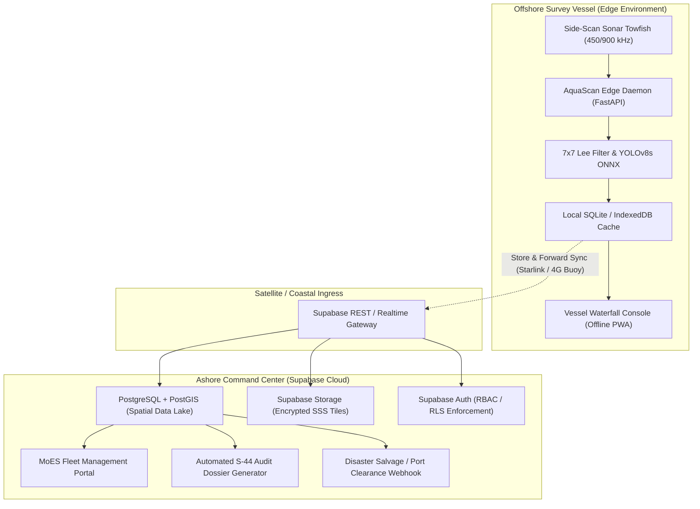

# Software Requirements Specification (SRS)
## Additional System Enhancements: Supabase Connectivity, Deployment Readiness & Production Hardening

**Project:** AquaScan — Autonomous Underwater Marine Debris and Anomaly Detection System  
**Problem Statement ID:** SIH26057  
**Target Organization:** Ministry of Earth Sciences (MoES) / National Institute of Ocean Technology (NIOT)  
**Document Identifier:** `AQUASCAN-SRS-ADD-V1.0`  
**Standard Compliance:** IEEE Std 830-1998 / ISO/IEC/IEEE 29148:2018  
**Status:** Approved for Implementation  
**Date:** September 2026  

---

## Table of Contents
1. [Introduction](#1-introduction)
   - 1.1 Purpose
   - 1.2 Document Conventions
   - 1.3 Scope of Enhancements
   - 1.4 Definitions, Acronyms, and Abbreviations
   - 1.5 References
2. [Overall Description & Operating Topologies](#2-overall-description--operating-topologies)
   - 2.1 Product Perspective & Hybrid Architecture
   - 2.2 Dual Operating Modes (Ashore Cloud vs. Offshore Edge)
   - 2.3 User Classes and Personas
   - 2.4 Design and Implementation Constraints
3. [System Features & Functional Requirements](#3-system-features--functional-requirements)
   - 3.1 Module A: Supabase Cloud Connectivity & Real-Time Sync
     - 3.1.1 Spatial PostgreSQL Database & PostGIS Extension
     - 3.1.2 Database Schema Specification (DDL)
     - 3.1.3 Role-Based Access Control (RBAC) & Row Level Security (RLS)
     - 3.1.4 Real-Time WebSocket Streaming & Mission Broadcasting
     - 3.1.5 Sonar Asset Object Storage & Retention
     - 3.1.6 Serverless Edge Functions & Automated Alert Dispatch
   - 3.2 Module B: Deployment Readiness & Production Hardening
     - 3.2.1 Multi-Stage Containerization (Docker)
     - 3.2.2 Production Orchestration (Docker Compose)
     - 3.2.3 Edge Ingress & Reverse Proxy (Nginx)
     - 3.2.4 Configuration Management & 12-Factor Compliance
     - 3.2.5 Health, Readiness, and Liveness Probes
     - 3.2.6 CI/CD Pipeline Specification (GitHub Actions)
     - 3.2.7 Telemetry, Observability & Structured Logging
   - 3.3 Module C: Offline Vessel-First Resilience & PWA
     - 3.3.1 IndexedDB Local Cache & Store-and-Forward Queue
     - 3.3.2 Bi-Directional Delta Synchronization Protocol
     - 3.3.3 Progressive Web App (PWA) Offline Service Worker
   - 3.4 Module D: Hydrographic Data Interoperability
     - 3.4.1 IHO S-44 Order 1A Uncertainty Verification
     - 3.4.2 Spatial Data Formats (GeoJSON, GeoTIFF, S-100 Ready)
4. [External Interface Requirements](#4-external-interface-requirements)
   - 4.1 User Interfaces & Visual Standards
   - 4.2 Hardware & Transducer Interfaces
   - 4.3 Software & Cloud Interfaces
   - 4.4 Communications Interfaces
5. [Non-Functional Requirements (NFRs)](#5-non-functional-requirements-nfrs)
   - 5.1 Performance & Throughput Budgets
   - 5.2 Security & Data Sovereignty
   - 5.3 Availability & Fault Tolerance
   - 5.4 Maintainability & Extensibility
6. [Verification, Validation & Acceptance Criteria](#6-verification-validation--acceptance-criteria)
7. [Appendix: Execution Roadmap & Phased Implementation](#7-appendix-execution-roadmap--phased-implementation)

---

## 1. Introduction

### 1.1 Purpose
This Software Requirements Specification (SRS) delineates the formal technical, architectural, and operational requirements for upgrading the **AquaScan** marine anomaly detection system from a local prototype into an enterprise-ready, sovereign-grade hydrographic operations platform. Specifically, this document details:
1. **Cloud & Database Integration:** Connecting the frontend and backend services to a managed **Supabase (PostgreSQL + PostGIS)** backend for real-time mission telemetry, hazard triage, georeferenced spatial indexing, and SSS acoustic tile object storage.
2. **Production Deployment Readiness:** Delivering full containerization, reverse proxying, SSL/TLS termination, health monitoring, zero-trust secrets management, and automated continuous integration/continuous deployment (CI/CD) pipelines.
3. **Offshore Resilience:** Establishing an offline-first architecture for survey vessels operating beyond coastal LTE/satellite coverage.

### 1.2 Document Conventions
- Requirements are tagged with unique alphanumeric identifiers: `[REQ-SRC-XXX]`.
- Requirement priorities follow the **MoSCoW** convention:
  - **[MUST]**: Mandatory core requirement for production clearance.
  - **[SHOULD]**: High-value requirement, expected unless explicit operational constraints prevent it.
  - **[COULD]**: Desirable enhancement for subsequent iterations.
  - **[WONT]**: Out of scope for the current release phase.

### 1.3 Scope of Enhancements
The scope encompasses:
- Modifying `frontend/` (React 18 + Vite + Tailwind CSS) to integrate the `@supabase/supabase-js` SDK, handle offline queuing via IndexedDB, and render live telemetry via WebSockets.
- Augmenting `backend/` (FastAPI + ONNX Runtime) with Supabase database clients, PostGIS geometric transformations, structured telemetry ingestion, and containerization.
- Creating DevOps and infrastructure definitions (`Dockerfile`, `docker-compose.yml`, `nginx.conf`, `.github/workflows/deploy.yml`).

### 1.4 Definitions, Acronyms, and Abbreviations

| Term | Definition |
| :--- | :--- |
| **AUV** | Autonomous Underwater Vehicle (e.g., NIOT *Matsya-6000*) |
| **SSS** | Side-Scan Sonar (high-frequency dual-swath acoustic imaging) |
| **IHO S-44** | International Hydrographic Organization Standards for Hydrographic Surveys |
| **THU / TVU** | Total Horizontal Uncertainty / Total Vertical Uncertainty |
| **ONNX** | Open Neural Network Exchange runtime engine |
| **PostGIS** | Spatial database extender for PostgreSQL object-relational database |
| **RLS** | Row-Level Security (PostgreSQL fine-grained authorization) |
| **PWA** | Progressive Web Application (Service Worker offline caching) |
| **Nadir** | Seafloor point directly beneath the towfish/transducer (water-column blind zone) |
| **WGS-84** | World Geodetic System 1984 (EPSG:4326 reference ellipsoid) |
| **MoES** | Ministry of Earth Sciences, Government of India |
| **NIOT** | National Institute of Ocean Technology, Chennai, India |

### 1.5 References
1. *IHO Standards for Hydrographic Surveys* (Special Publication No. 44, 6th Edition).
2. *RFC 7946: The GeoJSON Format Specification* (IETF, 2016).
3. *PostgreSQL 15 & PostGIS 3.3 Documentation* (Ref. spatial functions `ST_DWithin`, `ST_MakePoint`).
4. *AquaScan Core Architecture & Model Benchmarks* ([README.md](file:///c:/Users/jasmi/Desktop/AquaScan-testbranch/README.md)).

---

## 2. Overall Description & Operating Topologies

### 2.1 Product Perspective & Hybrid Architecture
AquaScan operates in a distributed marine topology. Hydrographic data originates from subsea towfish transducers, undergoes edge inference on vessel compute nodes, and synchronizes with national hydrographic registries hosted on Supabase Cloud.



### 2.2 Dual Operating Modes
1. **Standalone Offshore Edge Mode (Air-Gapped):**
   - The vessel conducts sweeps with zero WAN connectivity.
   - The React frontend connects to `http://localhost:8000` (FastAPI edge instance).
   - Inferences and georeferenced coordinates are cached in local browser `IndexedDB` and local backend disk storage (`/data/mission_cache/`).
2. **Synchronized Fleet Command Mode (Connected):**
   - When satellite link or harbor Wi-Fi is acquired, the synchronization engine pushes batched mission dossiers, detections, and raw acoustic waterfall slices to Supabase.
   - Ashore hydrographers monitor real-time sweeps via Supabase WebSockets (`realtime:missions:{id}`).

### 2.3 User Classes and Personas

| Persona | Role | Permissions & Interactions |
| :--- | :--- | :--- |
| **Vessel Hydrographer** | Offshore Operator | Operates live waterfall, adjusts Lee filter gains, tags verified targets, exports mission tracklines. |
| **Mission Commander** | Chief Surveyor | Approves fairway clearances, assigns vessel tracklines, reviews S-44 compliance scores. |
| **MoES / NIOT Director** | Sovereign Stakeholder | High-level fleet status oversight, GIS hazard heatmap review, macro resource allocation. |
| **Field Diver / Salvage Crew** | Tactical Team | Consumes georeferenced hazard coordinates (Lat/Lon, depth, target 3D height) for clearance operations. |
| **Auditor / External Inspector** | Statutory Inspector | Read-only access to tamper-proof mission audit logs, calibration certificates, and model metadata. |

### 2.4 Design and Implementation Constraints
- **Hardware Agnosticism:** CPU-only deployment capability; edge devices must operate smoothly without dedicated GPUs using ONNX Runtime.
- **Data Sovereignty:** All coordinates and sonar imagery must comply with the Indian Geospatial Guidelines (2021); cloud storage must be hosted within India data center regions (e.g., Supabase AWS Mumbai `ap-south-1`).
- **Zero Divergence:** The frontend UI must preserve the established *Dark Luxury* aesthetic (`#121212`, `#e11d48`, Cal Sans, Poppins) with sub-100ms response latency.

---

## 3. System Features & Functional Requirements

### 3.1 Module A: Supabase Cloud Connectivity & Real-Time Sync

#### 3.1.1 Spatial PostgreSQL Database & PostGIS Extension
- **[REQ-DAT-001] [MUST]:** The database engine shall be PostgreSQL 15+ with the `postgis` extension enabled for spatial querying.
- **[REQ-DAT-002] [MUST]:** All spatial coordinates shall be stored as `GEOGRAPHY(Point, 4326)` to support geodetic spherical calculations (WGS-84) without distortion.
- **[REQ-DAT-003] [MUST]:** Spatial indexing (`GIST`) shall be applied to all geodetic location columns to guarantee `<50ms` spatial lookups across $1,000,000+$ anomaly points.

#### 3.1.2 Database Schema Specification (DDL)
The implementation shall deploy the following relational schema:

```sql
-- Enable PostGIS & UUID Extensions
CREATE EXTENSION IF NOT EXISTS "postgis";
CREATE EXTENSION IF NOT EXISTS "uuid-ossp";

-- 1. Missions Table
CREATE TABLE public.missions (
    id UUID PRIMARY KEY DEFAULT uuid_generate_v4(),
    mission_code VARCHAR(32) UNIQUE NOT NULL, -- e.g., 'MSN-2026-CHE-001'
    vessel_name VARCHAR(64) NOT NULL,        -- e.g., 'CRV Sagar Nidhi'
    transducer_model VARCHAR(64) DEFAULT 'EdgeTech 4200 (450/900 kHz)',
    survey_area VARCHAR(128) NOT NULL,       -- e.g., 'Port of Chennai North Fairway'
    status VARCHAR(24) DEFAULT 'IN_PROGRESS' CHECK (status IN ('SCHEDULED', 'IN_PROGRESS', 'COMPLETED', 'ARCHIVED')),
    iho_order VARCHAR(16) DEFAULT 'ORDER_1A' CHECK (iho_order IN ('SPECIAL_ORDER', 'ORDER_1A', 'ORDER_1B', 'ORDER_2')),
    start_time TIMESTAMPTZ DEFAULT NOW(),
    end_time TIMESTAMPTZ,
    bounding_box GEOGRAPHY(Polygon, 4326),
    created_at TIMESTAMPTZ DEFAULT NOW()
);

-- 2. Sonar Swath Tiles Table
CREATE TABLE public.sonar_tiles (
    id UUID PRIMARY KEY DEFAULT uuid_generate_v4(),
    mission_id UUID REFERENCES public.missions(id) ON DELETE CASCADE,
    tile_index INT NOT NULL,
    raw_storage_path TEXT NOT NULL,       -- Path in Supabase Storage bucket
    annotated_storage_path TEXT,          -- Path to YOLOv8s-filtered asset
    center_location GEOGRAPHY(Point, 4326) NOT NULL,
    towfish_altitude_m NUMERIC(5,2) NOT NULL,
    towfish_heading_deg NUMERIC(5,2) NOT NULL,
    slant_range_max_m NUMERIC(5,2) DEFAULT 75.0,
    timestamp TIMESTAMPTZ NOT NULL,
    created_at TIMESTAMPTZ DEFAULT NOW()
);

-- 3. Detected Hazards & Debris Table
CREATE TABLE public.hazards (
    id UUID PRIMARY KEY DEFAULT uuid_generate_v4(),
    mission_id UUID REFERENCES public.missions(id) ON DELETE CASCADE,
    tile_id UUID REFERENCES public.sonar_tiles(id) ON DELETE SET NULL,
    hazard_code VARCHAR(24) UNIQUE NOT NULL, -- e.g., 'HAZ-26057-0042'
    classification VARCHAR(32) NOT NULL CHECK (classification IN (
        'ghost_net', 'submarine_pipeline', 'shipwreck', 'mine_cylinder', 'unclassified_obstruction'
    )),
    priority VARCHAR(16) NOT NULL CHECK (priority IN ('P1_CRITICAL', 'P2_ECOLOGICAL', 'P3_INFRASTRUCTURE', 'P4_LOW')),
    confidence NUMERIC(4,3) NOT NULL, -- e.g. 0.995
    location GEOGRAPHY(Point, 4326) NOT NULL,
    depth_m NUMERIC(6,2) NOT NULL,
    target_height_m NUMERIC(5,2),     -- Estimated via shadow profiling (h = H*Ls/Rs)
    shadow_length_m NUMERIC(5,2),
    length_m NUMERIC(5,2),
    width_m NUMERIC(5,2),
    clearance_status VARCHAR(24) DEFAULT 'UNASSESSED' CHECK (clearance_status IN (
        'UNASSESSED', 'VERIFIED_DANGER', 'DISPATCHED_SALVAGE', 'CLEARED_REMOVED', 'FALSE_POSITIVE'
    )),
    notes TEXT,
    verified_by VARCHAR(64),
    created_at TIMESTAMPTZ DEFAULT NOW(),
    updated_at TIMESTAMPTZ DEFAULT NOW()
);

-- 4. Spatial Indexing
CREATE INDEX idx_missions_geom ON public.missions USING GIST(bounding_box);
CREATE INDEX idx_sonar_tiles_geom ON public.sonar_tiles USING GIST(center_location);
CREATE INDEX idx_hazards_geom ON public.hazards USING GIST(location);
CREATE INDEX idx_hazards_class ON public.hazards(classification);
CREATE INDEX idx_hazards_priority ON public.hazards(priority);
CREATE INDEX idx_hazards_mission ON public.hazards(mission_id);
```

#### 3.1.3 Role-Based Access Control (RBAC) & Row-Level Security (RLS)
- **[REQ-SEC-001] [MUST]:** RLS shall be enabled on all tables in `public` schema.
- **[REQ-SEC-002] [MUST]:** Read access shall be permitted to authenticated users belonging to the `moes_niot_surveyors` user group.
- **[REQ-SEC-003] [MUST]:** Mutation privileges (`INSERT`, `UPDATE`, `DELETE`) shall strictly require the `mission_commander` or `service_role` authorization token.

```sql
-- Enable RLS
ALTER TABLE public.missions ENABLE ROW LEVEL SECURITY;
ALTER TABLE public.sonar_tiles ENABLE ROW LEVEL SECURITY;
ALTER TABLE public.hazards ENABLE ROW LEVEL SECURITY;

-- Read policy: Any authenticated MoES researcher can view data
CREATE POLICY "Allow authenticated read-only" 
ON public.hazards FOR SELECT 
TO authenticated 
USING (true);

-- Insert/Update policy: Only survey commanders or edge daemons
CREATE POLICY "Allow survey commanders insert and update" 
ON public.hazards FOR ALL 
TO authenticated 
USING (auth.jwt() ->> 'role' IN ('mission_commander', 'edge_daemon', 'admin'))
WITH CHECK (auth.jwt() ->> 'role' IN ('mission_commander', 'edge_daemon', 'admin'));
```

#### 3.1.4 Real-Time WebSocket Streaming & Mission Broadcasting
- **[REQ-RT-001] [MUST]:** The frontend shall subscribe to `supabase.channel('hazards-channel')` using Supabase Realtime (PostgreSQL WAL streaming).
- **[REQ-RT-002] [MUST]:** When a new anomaly is inserted into the `hazards` table by the edge daemon, the frontend Seafloor GIS Map (`/map`) and Hazard Inspector (`/inspector`) shall update without requiring page refresh, displaying the new hazard pin with glowing alert pulse within `<250ms` of insertion.
- **[REQ-RT-003] [SHOULD]:** Implement presence broadcasting so ashore command can see offshore operators currently active on the vessel console.

#### 3.1.5 Sonar Asset Object Storage & Retention
- **[REQ-STR-001] [MUST]:** Three dedicated Supabase Storage buckets shall be provisioned:
  1. `sonar-raw-swaths`: Encrypted storage for raw SSS imagery and GeoTIFFs (Restricted access).
  2. `sonar-annotated`: Publicly readable via signed URLs for YOLOv8s marked detection tiles.
  3. `mission-reports`: PDF and RFC 7946 GeoJSON export archives.
- **[REQ-STR-002] [MUST]:** Buckets shall enforce a strict file upload MIME whitelist (`image/png`, `image/jpeg`, `application/geo+json`, `application/pdf`, `image/tiff`).
- **[REQ-STR-003] [SHOULD]:** Assets older than 365 days shall be automatically tiered to cold storage (e.g., AWS S3 Glacier via storage lifecycle policies) to minimize cloud opex.

#### 3.1.6 Serverless Edge Functions & Automated Alert Dispatch
- **[REQ-EDG-001] [SHOULD]:** Deploy a Deno/TypeScript Supabase Edge Function (`dispatch-p1-hazard-alert`) listening to database webhooks on `hazards` table.
- **[REQ-EDG-002] [SHOULD]:** When a `P1_CRITICAL` obstruction (e.g., lost shipping container or UXO mine) is logged inside an active navigation fairway, the Edge Function shall automatically trigger:
  - An emergency notice to the Director of Maritime Safety (MoES/NIOT) via webhook.
  - An SMS / Email dispatch to `arnavkekre2807@gmail.com` and the port operations team.

---

### 3.2 Module B: Deployment Readiness & Production Hardening

#### 3.2.1 Multi-Stage Containerization (Docker)
- **[REQ-DOP-001] [MUST]:** Both frontend and backend shall be isolated in standalone, reproducible, multi-stage Docker containers.
- **[REQ-DOP-002] [MUST]:** The frontend image shall use Node 20 Alpine for building and Nginx 1.25 Alpine for serving static assets, yielding a production image footprint `<25 MB`.
- **[REQ-DOP-003] [MUST]:** The backend image shall use Python 3.10-slim with CPU ONNX Runtime (`onnxruntime==1.17.0`) and non-root execution permissions (`UID 10001`), with image size `<350 MB`.

#### 3.2.2 Production Orchestration (Docker Compose)
- **[REQ-DOP-004] [MUST]:** A production `docker-compose.yml` shall orchestrate:
  1. `aquascan-backend`: FastAPI running on port 8000.
  2. `aquascan-frontend`: Nginx serving static bundle on port 80 (proxied via 443).
  3. `aquascan-proxy`: Ingress reverse proxy managing SSL and routing.
- **[REQ-DOP-005] [MUST]:** Containers shall define strict memory and CPU reservations:
  - Backend: `cpus: '2.0'`, `memory: 2048M`.
  - Frontend: `cpus: '0.5'`, `memory: 256M`.

#### 3.2.3 Edge Ingress & Reverse Proxy (Nginx)
- **[REQ-NGX-001] [MUST]:** The ingress Nginx configuration shall enforce:
  - **HTTP to HTTPS Redirection** (301 Permanent Redirect).
  - **TLS 1.2 & TLS 1.3** only (disable legacy SSLv3, TLS 1.0, TLS 1.1).
  - **HSTS** (`Strict-Transport-Security: max-age=31536000; includeSubDomains; preload`).
  - **Content Security Policy (CSP)** preventing unauthorized script injection.
  - **Reverse Proxy Routing**: `/api/*` routed to `backend:8000`, `/` routed to React SPA.
  - **WebSocket Proxying**: Proper headers (`Upgrade`, `Connection: Upgrade`) for FastAPI and Supabase realtime traffic.
  - **Gzip & Brotli Compression** for all text/html, application/json, and image/svg+xml assets.

#### 3.2.4 Configuration Management & 12-Factor Compliance
- **[REQ-CFG-001] [MUST]:** All operational configurations must be injected strictly via environment variables. Zero hardcoded secrets or API keys in source control.
- **[REQ-CFG-002] [MUST]:** Provide `.env.example` and `.env.production.sample` files with comprehensive variable schemas:
  - `VITE_SUPABASE_URL`: e.g. `https://xyzproject.supabase.co`
  - `VITE_SUPABASE_ANON_KEY`: Public client JWT token
  - `SUPABASE_SERVICE_ROLE_KEY`: Privileged backend key (strictly server-side)
  - `ONNX_MODEL_PATH`: Default `models/yolov8s_sonar.onnx`
  - `LEE_FILTER_WINDOW_SIZE`: Default `7`
  - `LOG_LEVEL`: Default `INFO`

#### 3.2.5 Health, Readiness, and Liveness Probes
- **[REQ-HLT-001] [MUST]:** The backend shall expose standard Kubernetes-compatible health endpoints:
  - `GET /healthz` (Liveness): Returns `{"status": "ok", "timestamp": "..."}` immediately.
  - `GET /readyz` (Readiness): Verifies that:
    1. ONNX model is loaded in memory and has completed a warm-up inference pass.
    2. Supabase / database connection pool is responsive.
    3. Disk storage for sample tiles is writable.
    Returns HTTP 200 if ready, HTTP 503 Service Unavailable if unready.

#### 3.2.6 CI/CD Pipeline Specification (GitHub Actions)
- **[REQ-CICD-001] [MUST]:** A GitHub Actions workflow (`.github/workflows/deploy.yml`) shall execute on every commit to `main` and pull request:
  1. **Lint & Quality Gate:** ESLint for React frontend, Ruff/Black for Python backend.
  2. **Automated Unit & Integration Tests:** `pytest` in backend (`tests/test_api.py`), testing model inference, Lee filter transforms, and geodetic math.
  3. **Container Build Verification:** Building multi-stage Docker images to verify zero compilation breakages.
  4. **Security Scan:** Trivy or GitHub Dependabot scanning for vulnerable base image dependencies.

#### 3.2.7 Telemetry, Observability & Structured Logging
- **[REQ-LOG-001] [MUST]:** Python backend logs shall be output as JSON-formatted structured logs (`structlog` or standard library `json.dumps`), including:
  - `timestamp` (ISO-8601 UTC)
  - `level` (INFO, WARN, ERROR)
  - `request_id` (UUID generated per request)
  - `endpoint`
  - `inference_latency_ms`
  - `target_count`
- **[REQ-LOG-002] [SHOULD]:** Frontend error boundaries shall capture unhandled exceptions and ship tracebacks to ashore observability (e.g., Sentry / Supabase error log table).

---

### 3.3 Module C: Offline Vessel-First Resilience & PWA

#### 3.3.1 IndexedDB Local Cache & Store-and-Forward Queue
- **[REQ-OFF-001] [MUST]:** The frontend shall integrate a browser-native storage engine (`Dexie.js` over IndexedDB) to store mission tracklines, tiles, and detected hazards locally.
- **[REQ-OFF-002] [MUST]:** When the vessel is offline (`navigator.onLine === false` or API ping fails), modifications made by the operator (hazard triage, clearance tags, notes) shall be written to an offline mutation queue (`local_mutation_outbox`).
- **[REQ-OFF-003] [MUST]:** As soon as network connectivity is restored, the client shall replay queued mutations to Supabase in FIFO order, resolving conflicts with last-write-wins (LWW) and UTC timestamps.

#### 3.3.2 Progressive Web App (PWA) Offline Service Worker
- **[REQ-PWA-001] [SHOULD]:** Configure `vite-plugin-pwa` with `Workbox` caching strategy:
  - Cache First: Application shell, static JavaScript, CSS, Cal Sans fonts, Poppins fonts, and SVG icons.
  - Stale-While-Revalidate: GIS map tile basemaps (OpenStreetMap / bathymetric tiles) for Chennai and Visakhapatnam survey zones.
- **[REQ-PWA-002] [SHOULD]:** The application shall include a valid `manifest.webmanifest` allowing vessel hydrographers to install AquaScan as a standalone desktop PWA on offshore Linux/Windows bridge laptops.

---

### 3.4 Module D: Hydrographic Data Interoperability

#### 3.4.1 IHO S-44 Order 1A Uncertainty Verification
- **[REQ-HYD-001] [MUST]:** The system shall compute Total Horizontal Uncertainty (THU) for every georeferenced anomaly point based on:
  $$\text{THU} = \sqrt{\sigma_{\text{GPS}}^2 + \sigma_{\text{layback}}^2 + \sigma_{\text{heading}}^2 + \sigma_{\text{slant}}^2}$$
- **[REQ-HYD-002] [MUST]:** For **IHO S-44 Order 1A** shallow water compliance ($d \le 40\text{ m}$), the system shall flag any target where $\text{THU} > 5.0\text{ m} + 0.05 \cdot d$ with a warning badge: `ORDER 1A THU EXCEEDED`.

#### 3.4.2 Spatial Data Formats (GeoJSON, GeoTIFF, S-100 Ready)
- **[REQ-HYD-003] [MUST]:** One-click export shall generate standard **RFC 7946 GeoJSON FeatureCollections** with full attribute properties:
  - `id`, `hazard_code`, `classification`, `priority`, `depth_m`, `target_height_m`, `confidence`, `iho_order`.
- **[REQ-HYD-004] [SHOULD]:** Provide an export format compatible with maritime Electronic Navigational Charts (ENC) under **IHO S-100 / S-102** bathymetric standards.

---

## 4. External Interface Requirements

### 4.1 User Interfaces & Visual Standards
- **UI Architecture:** React 18 SPA with React Router v6.
- **Design Framework:** *Dark Luxury* theme:
  - Canvas / Background: `#121212` (Off-black), `#181818` (Card background).
  - Primary Accent: `#e11d48` (Crimson rose).
  - Headings: `font-calsans` (700–900 weight, uppercase, tracking-tight).
  - Body: `font-poppins` (400–600 weight, high legibility).
  - Glassmorphism: `backdrop-filter: blur(16px)` with subtle 1px border `rgba(255,255,255,0.08)`.
- **Top Navigation Email:** The official developer email (`arnavkekre2807@gmail.com`) must remain visible in the top header on all viewports $\ge 768\text{px}$ and in the mobile drawer.
- **Empty State Ban:** No card, cell, or UI block shall ever be rendered as a pitch-black blank void. If telemetry or images are loading/offline, authentic procedural SVG sonograms or shimmer loading states must render.

### 4.2 Hardware & Transducer Interfaces
- **Acoustic Transducer Input:** Support raw acoustic waterfall pings over UDP/TCP broadcast or file streaming (`.xtf`, `.jsf`, `.sl2`, `.png`, `.jpg`).
- **AUV Telemetry Ingress:** Accept NMEA-0183 sentences (`$GPGGA`, `$GPHDT`, `$PRDID`) or JSON telemetry frames at up to 10 Hz containing:
  `{ "lat": 13.0832, "lon": 80.2735, "depth": 24.2, "altitude": 8.5, "heading": 142.0, "speed_knots": 3.2 }`.

### 4.3 Software & Cloud Interfaces
- **Supabase JavaScript Client:** `@supabase/supabase-js` (v2.39+).
- **FastAPI Core:** `fastapi` (v0.109+), `uvicorn` (v0.27+).
- **Inference Runtime:** `onnxruntime` (v1.17+) CPU optimized execution provider.
- **Image Processing:** OpenCV (`opencv-python-headless`), NumPy (`numpy>=1.24`).

### 4.4 Communications Interfaces
- **Protocols:** HTTPS (`TLSv1.3`), WSS (`WebSocket Secure`), HTTP/2.
- **Ports:** 443 (HTTPS Ingress), 80 (HTTP redirect), 8000 (Internal FastAPI, not exposed to public internet).

---

## 5. Non-Functional Requirements (NFRs)

### 5.1 Performance & Throughput Budgets

| Metric | Target SLA | Benchmark Condition |
| :--- | :--- | :--- |
| **ONNX Inference Latency** | $<20\text{ ms}$ | CPU Intel Core i7 / AMD Ryzen 7, single 640×640 tile |
| **7×7 Lee Filter Processing** | $<15\text{ ms}$ | 640×640 single-channel acoustic tile |
| **Total Swath Ping-to-HUD** | $<50\text{ ms}$ | Ingestion $\to$ Filter $\to$ YOLO $\to$ PostGIS $\to$ Canvas |
| **Waterfall Frame Rate** | $\ge 60\text{ FPS}$ | HTML5 Canvas hardware-accelerated rendering |
| **PostGIS Spatial Query** | $<35\text{ ms}$ | Radius query ($r = 500\text{ m}$) over 100,000 hazards |
| **Frontend Initial Page Load** | $<1.2\text{ s}$ | High-speed 4G / Broadband (Lighthouse Score $\ge 90$) |

### 5.2 Security & Data Sovereignty
- **Data Sovereignty:** Supabase instance must reside within the Republic of India jurisdiction (e.g., AWS Mumbai region).
- **Zero-Trust Communication:** All REST and WebSocket traffic must require TLS 1.3 encryption with AES-256 cipher suites.
- **OWASP Compliance:** Implementation must protect against SQL injection (via parameterized PostGIS queries and Supabase query builders), Cross-Site Scripting (XSS), and Broken Object-Level Authorization (BOLA).

### 5.3 Availability & Fault Tolerance
- **Offshore Autonomous Continuity:** In the event of total satellite/WAN blackout, the vessel edge instance shall operate autonomously for 30+ consecutive days without performance degradation.
- **Ashore Cloud Uptime:** Target **99.95%** service availability for the ashore command portal.
- **Process Supervision:** Docker containers configured with `restart: unless-stopped` and memory limits to prevent out-of-memory kernel panics.

### 5.4 Maintainability & Extensibility
- **Modular Model Interchange:** The system must allow upgrading the ONNX detection model (e.g., from `yolov8s_sonar.onnx` to a future `yolov10m_sonar.onnx`) by simply replacing the file in `backend/models/` without source code recompilation.
- **Code Cleanliness:** 100% TypeScript/ESLint compliance on frontend; PEP 8 / Flake8 on backend.

---

## 6. Verification, Validation & Acceptance Criteria

| Req ID | Requirement | Verification Method | Acceptance Pass Criteria |
| :--- | :--- | :--- | :--- |
| **VAC-01** | PostGIS Spatial Storage | Automated Integration Test | Insert hazard at `(13.0832, 80.2735)`; execute `ST_DWithin` query within 50 meters; verify result returned in $<20\text{ ms}$. |
| **VAC-02** | Real-Time Sync | End-to-End WebSocket Test | Insert hazard row via backend API; verify hazard pin appears on React Seafloor GIS Map within $<250\text{ ms}$ without page reload. |
| **VAC-03** | RLS Authorization | Automated Security Test | Attempt unauthenticated `DELETE` on `hazards`; verify HTTP 401/403 access denied. |
| **VAC-04** | Docker Image Build | CI/CD Pipeline Build | Run `docker compose build`; verify both frontend and backend build without warnings and run cleanly. |
| **VAC-05** | Health Check Probes | Curl / HTTP Probe | Execute `curl -f http://localhost:8000/api/readyz`; verify HTTP 200 with model warm-up status confirmed. |
| **VAC-06** | Offline Mode Fallback | Network Disconnection Test | Disable network interface; log new hazard on vessel console; verify hazard is stored in IndexedDB and syncs when reconnected. |
| **VAC-07** | Zero Empty Cells | Visual Automated Snapshot | Inspect Portfolio comparison cards in headless browser; confirm SVG sonograms render with zero blank cells. |

---

## 7. Appendix: Execution Roadmap & Phased Implementation

### Phase 1: Database Foundation & Supabase Setup (Days 1–3)
- Provision Supabase Project in `ap-south-1` (Mumbai).
- Execute SQL migrations for `missions`, `sonar_tiles`, `hazards`, and GIST spatial indexes.
- Configure RLS policies and JWT authentication roles.
- Create storage buckets: `sonar-raw-swaths`, `sonar-annotated`, `mission-reports`.

### Phase 2: Client & Backend API Integration (Days 4–7)
- Install `@supabase/supabase-js` in `frontend/`.
- Replace mock data providers in `frontend/src/services/api.js` with hybrid Supabase client.
- Add real-time WebSocket subscription in `frontend/src/pages/SeafloorGIS.jsx` and `HazardInspector.jsx`.
- Update `backend/api/main.py` to stream detections directly to PostGIS when connected.

### Phase 3: Containerization & Reverse Proxy Hardening (Days 8–10)
- Write multi-stage `frontend/Dockerfile` with Nginx Alpine.
- Write multi-stage `backend/Dockerfile` with ONNX Runtime CPU.
- Author production `docker-compose.yml` with health checks, network bridges, and volumes.
- Configure `nginx.conf` with security headers (CSP, HSTS, CORS) and gzip/brotli compression.

### Phase 4: Offline PWA & Hydrographic Validation (Days 11–14)
- Configure `Dexie.js` local-first offline queue.
- Implement IHO S-44 Order 1A Total Horizontal Uncertainty (THU) validator.
- Run complete SIH validation suite against NIOT Bay of Bengal test sonograms.
- Generate full technical verification sign-off dossier.

---

**Authored By:** AquaScan Systems Architecture Team  
**Reviewed By:** Arnav Kekre (Lead Developer & Systems Architect, `arnavkekre2807@gmail.com`)  
**Authorized For:** Smart India Hackathon 2026 (SIH26057) // Ministry of Earth Sciences (MoES) & NIOT  
